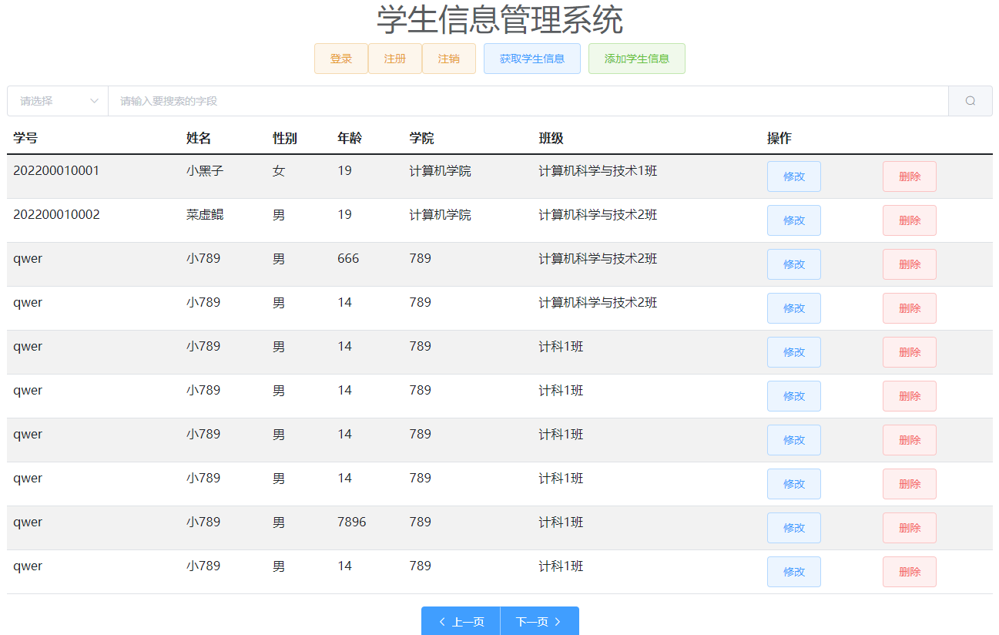

## 一个简易的学生管理系统

参考别人的程序，做了一点修改（可选择不同的查询模式）

**项目文件介绍：**

StudentManagementSystem-java：后端代码（Java）

vuedemo：前端代码（Vue2）

**效果：**

登录界面

登录成功

获取所有学生信息

按姓名模糊搜索

按性别模糊搜索

选择搜索模式

## 参考
b站up主（西林张小猿）：https://www.bilibili.com/video/BV1NY411g7cf